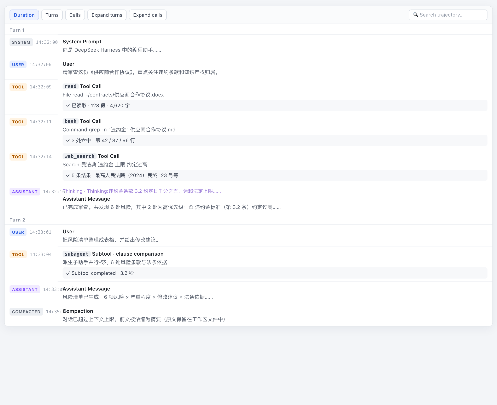
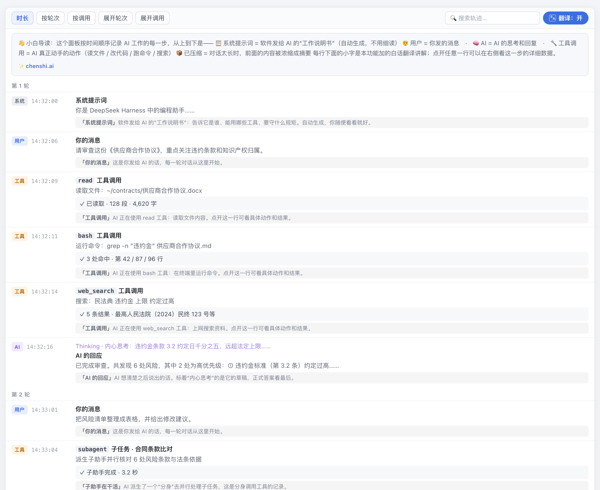

# 🈶 轨迹面板中文翻译 · 小白导读

<div align="center">

**让 DeepSeek Harness 的「轨迹面板」对非程序员同样友好 —— 全中文标签 + 逐条白话讲解 + 顶部导读**

[](https://opensource.org/licenses/MIT)
[](https://github.com/CSlawyer1985/trajectory-zh-guide)
[-orange.svg)](https://github.com/CSlawyer1985)
[](https://github.com/deepseek-ai/deepseek-harness)

120+ 术语翻译 | 7 类轨迹逐条讲解 | 导读横幅 | 一键开关 | 静态 client 模块 · 升级不丢

[📖 项目简介](#-项目简介) • [🎯 为什么需要](#-为什么需要这个工具) • [📸 效果展示](#-效果展示) • [🚀 安装](#-安装) • [❓ 常见问题](#-常见问题)

</div>

---

## 📖 项目简介

**DeepSeek Harness** 是运行在你电脑上的 AI 工作台——它不只聊天，还能读文件、改代码、跑命令、上网搜索。它的**轨迹面板**记录 AI 干活的每一步（相当于 AI 的"工作监控录像"），但界面是给程序员设计的：满屏英文术语（`Tokens`、`TTFT`、`Tool Call`、`System Prompt`……），非程序员根本看不懂。

**本插件把轨迹面板翻译成人话**：所有英文标签变中文，每条轨迹下面加一句白话讲解，顶部再给一张"导读地图"。它不改 AI 的任何行为，只改界面显示。

### v2.0 升级：静态 client 模块

v2.0 起，本插件以 **DSH 静态 client 模块**形态安装（与 Harness 内置界面插件同一机制）：

- ✅ **升级主程序不丢失** —— 不再修改 node_modules 里的界面文件，而是作为独立插件包注册进组合（cordis.patch.yml），随 DSH 启动自动加载
- ✅ 无需审批、无需动态插件机制、重启后依然生效
- ✅ 旧的快速补丁（apply.sh）仍保留，适合临时体验

### 核心价值

💡 **文科生也能看懂** - 120+ 术语全中文，连 `Turn 2 → 第 2 轮`、`128 tok → 128 词元` 都翻译
🚀 **逐条白话讲解** - 每行轨迹自动配一句解释：它在读文件？跑命令？还是上网搜法条？
🧭 **顶部导读横幅** - 打开面板先看"阅读地图"，5 秒钟掌握整个面板怎么看
🔘 **一键开关** - 「文/A 翻译」按钮随时开/关，你的选择被记住，刷新不丢
🔒 **绝对安全** - 纯本地、不联网、不上传任何数据；代码透明，任何人都可检查

---

## 🎯 为什么需要这个工具？

### 轨迹面板是什么？

AI 干活时，它背后的"工作日志"会记录每一个动作：

| 轨迹类型 | AI 在做什么 | 没翻译时你看到 | 翻译后你看到 |
|----------|-------------|----------------|--------------|
| 📋 系统提示词 | 开机时收到的工作说明书 | `System Prompt` | 「系统提示词」软件发给 AI 的工作说明书 |
| 🧑 用户 | 你发的消息 | `USER` | 「你的消息」这是你发给 AI 的话 |
| 🔧 工具调用 | 读文件 / 跑命令 / 搜网页 | `Tool Call · read` | 「工具调用」AI 正在使用 read 工具：读取文件内容 |
| 🧠 AI | AI 的思考和回复 | `Thinking` | 「AI 的回应」标着内心思考的是它的草稿 |
| 📦 记忆压缩 | 对话太长自动浓缩摘要 | `Compaction` | 「记忆压缩」前面的内容被浓缩，原文没有丢 |

> 没有它：看到 `TTFT 1.2s · 128 tok · Cache created`，一头雾水。
> 有了它：**「首字延迟 1.2 秒 · 128 词元 · 已建立缓存」**，一眼就懂 AI 干得快不快、省不省钱。

---

## 📸 效果展示

### 安装前：全英文，看不懂



### 安装后：全中文 + 逐条讲解 + 导读横幅



### 开关按钮：随时切换中/英


---

## ✨ 核心特性

- **120+ 术语中文翻译**：工具栏、行标签、详情面板全覆盖（Turns→按轮次、Duration→时长、Tokens→词元数、TTFT→首字延迟、Payload→提交的数据……）
- **7 类轨迹白话讲解**：系统 / 用户 / AI 回复 / 工具调用 / 子助手 / 背景信息 / 记忆压缩，每行自动加注
- **认识具体工具**：能认出 `read`、`bash`、`web_search`、`subagent` 等 30+ 常见工具并解释用途
- **动态跟随**：AI 运行中的状态变化（Pending→Completed）翻译实时跟进，不过期
- **开关记忆**：翻译状态存于浏览器本地，刷新/重启不丢失
- **自愈式稳定性**：面板重绘、切换会话都不会丢失讲解与开关；杜绝了早期版本可能出现的性能死循环问题

---

## 🚀 安装

> 需要先安装好 [DeepSeek Harness](https://github.com/deepseek-ai/deepseek-harness)。

### 方式 A：静态 client 模块（推荐，升级主程序不丢失）

**第 1 步**：下载本仓库（绿色 `Code` → `Download ZIP`，解压）。

**第 2 步**：打开终端（Mac：`Command+空格` 搜"终端"；Windows：Git Bash）。

**第 3 步**：进入仓库文件夹（`cd ` 后把文件夹拖进终端，回车），运行：

```bash
bash install-dsh.sh
```

脚本自动完成三件事：
1. 把插件包安装到 DSH 主 node_modules 和 profile node_modules（自动探测运行中的 DSH 安装目录）；
2. 在 `~/.dsh/profiles/web/cordis.patch.yml` 注册插件行（幂等，自动备份）；
3. 登记到 profile 的 package.json 依赖。

**第 4 步**：重启 DSH（退出并重新打开 DeepSeek Harness 桌面应用，或运行你的重启脚本），然后刷新浏览器 → 打开任意会话 → 点顶部「轨迹」标签页。

### 方式 B：快速补丁（临时体验，升级主程序会失效）

```bash
cd /你的文件夹路径
bash apply.sh
```
脚本自动找到轨迹面板文件、备份原件、注入翻译逻辑。升级 DSH 后需要重新运行。

---

## 🔧 卸载

**方式 A（静态模块）**：把 `~/.dsh/profiles/web/cordis.patch.yml` 中 `trajectory-zh-guide` 的注册行删除（备份文件 `cordis.patch.yml.bak` 可一键还原），重启 DSH 即可。

**方式 B（快速补丁）**：把安装时自动生成的 `client.js.bak` 复制回 `client.js`。

也可以不卸载——点横幅上的「翻译：关」按钮，随时切回英文界面。

---

## 🛡️ 安全说明

- ✅ **纯本地运行**：不联网、不上传任何数据、不收集任何信息
- ✅ **不改 AI 行为**：只翻译界面文字，AI 的工作过程一字不动
- ✅ **安装可逆**：静态模块卸载只需删一行注册；补丁方式有自动备份
- ✅ **代码透明**：全部逻辑就是一个 `lib/client.js`（约 500 行），任何人都可检查

---

## ❓ 常见问题

**Q：升级 Harness 后翻译失效了？**
A：**方式 A（静态模块）不会失效**——这是 v2.0 的主要改进。如果 DSH 升级后注册行还在但模块没加载，重跑一次 `bash install-dsh.sh` 再重启即可。**方式 B（快速补丁）会失效**，需要重跑 `bash apply.sh`。

**Q：两种方式都装会冲突吗？**
A：会重复显示两个开关，不建议。用方式 A 时请把方式 B 还原（`cp client.js.bak client.js`）。

**Q：关掉翻译会影响 AI 干活吗？**
A：完全不会，它只是界面显示。

**Q：翻译会不会过期？**
A：v3 起翻译实时跟随——React 更新过的文字（如状态从 Pending 变 Completed）会自动重新翻译。

**Q：分享给别人怎么用？**
A：把整个仓库文件夹发过去（或让对方 clone），运行 `bash install-dsh.sh` 即可，无需登录、无需审批。

---

## 👤 作者

**陈石（CS）** · [chenshi.ai](https://chenshi.ai) · 欢迎 Issue、欢迎转发

## 📄 许可证

[MIT License](LICENSE) —— 自由使用、修改、分享，注明出处即可。
